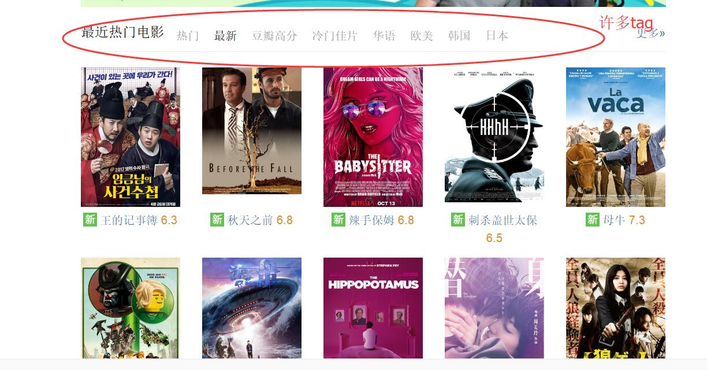
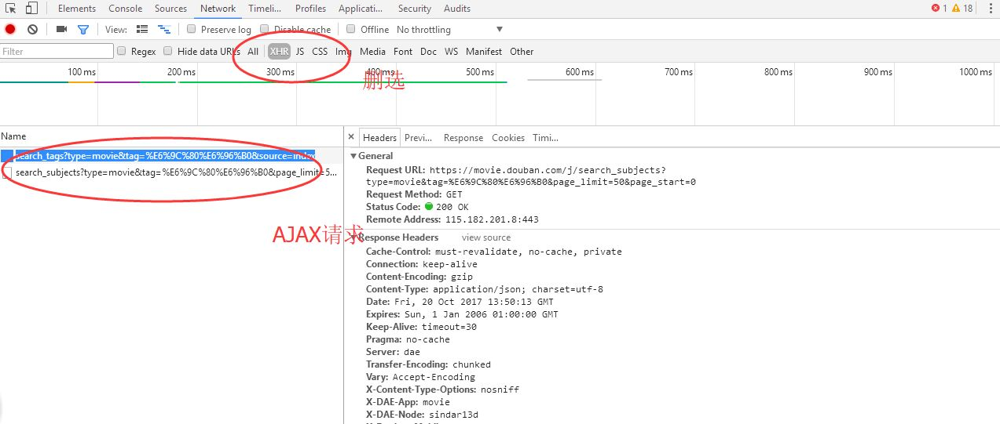

# 抓取ajax传输的数据
===

## ajax
现在大多数网站都采用ajax技术与服务器进行交互，能够在不刷新页面的情况下更新页面数据

以豆瓣为例，下图中有许多`最近热门电影`的标签，在标签之间切换的过程中发现没有刷新页面，但是查看网页源代码的时候并没有发现想要的数据，当然在抓取页面的时候也获取不到数据。

在网页源代码中搜索`刺杀该是太保`0个匹配

AJAX 是 Asynchronous JavaScript and XML（异步的 JavaScript 和 XML）的缩写。AJAX 通过使用原有的 web 标准组件，实现了在不重新加载整个页面的情况下，与服务器进行数据交互。例如在新浪微博中，你可以展开一条微博的评论，而不需要重新加载，或者打开一个新的页面。但是这些内容并不是一开始就在页面中的（这样页面就太大了），而是在你点击的时候被加载进来的。这就导致了你抓取这个页面的时候，并不能获得这些评论信息（因为你没有『展开』）。

AJAX 的一种常见用法是使用 AJAX 加载 JSON 数据，然后在浏览器端渲染。如果能直接抓取到 JSON 数据，会比 HTML 更容易解析。

## 找到访问接口
打开开发者工具->networks->删选`XHR`

找到正确接口之后就可以像之前一样抓取数据了

>需要注意的是在处理返回数据的时候需要对数据进行解码这时候可以使用`chardet`模块，然后再用`json`模块将数据转为json格式更加容易处理